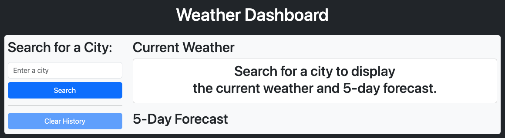
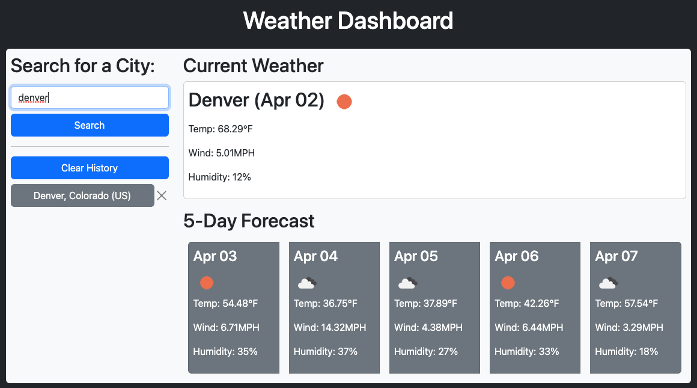
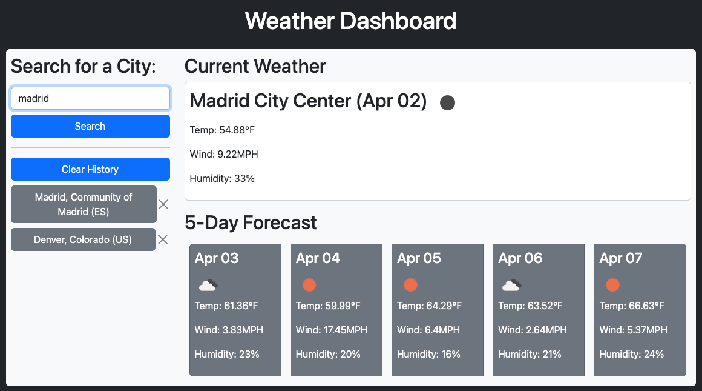
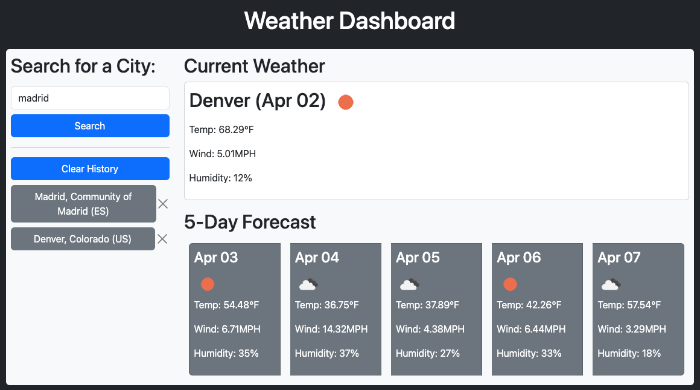

# Challenge 06 - Weather Dashboard

## Project Description

The scheduler web app will help the end user keep track of their work schedule. It will visually inform them which events have ended, which event is currently taking place, and what their schedule looks like for the rest of the day. It also allows them to update their schedule on the fly and to come back to it throughout the day.

I used the following third party APIs/libraries to create this web app:
- Bootstrap
- Font Awesome
- Google Fonts
- jQuery
- Day.js

The library I used the most while building this app was jQuery. I am starting to feel more comfortable traversing and dynamically updating the DOM using the objects and methods available in this library as well as navigating its documentation. All in all it was a very fulfilling experience that kept me engaged as I noticed the progress I was making.

## Table of Contents
- [User Story](#user-story)
- [Acceptance Criteria](#acceptance-criteria)
- [Links](#links)
- [Screenshots](#screenshots)

## User Story

```
AS A traveler
I WANT to see the weather outlook for multiple cities
SO THAT I can plan a trip accordingly
```

## Acceptance Criteria

```
GIVEN a weather dashboard with form inputs
WHEN I search for a city
THEN I am presented with current and future conditions for that city and that city is added to the search history
WHEN I view current weather conditions for that city
THEN I am presented with the city name, the date, an icon representation of weather conditions, the temperature, the humidity, and the wind speed
WHEN I view future weather conditions for that city
THEN I am presented with a 5-day forecast that displays the date, an icon representation of weather conditions, the temperature, the wind speed, and the humidity
WHEN I click on a city in the search history
THEN I am again presented with current and future conditions for that city
```
 
## Links

To access the code repository and live website, use the links below:

- ### GitHub Repository URL
    https://github.com/sergiorodriguezdev/chl-06-weather-dashboard
- ### GitHub Pages URL
    https://sergiorodriguezdev.github.io/chl-06-weather-dashboard/

## Screenshots







